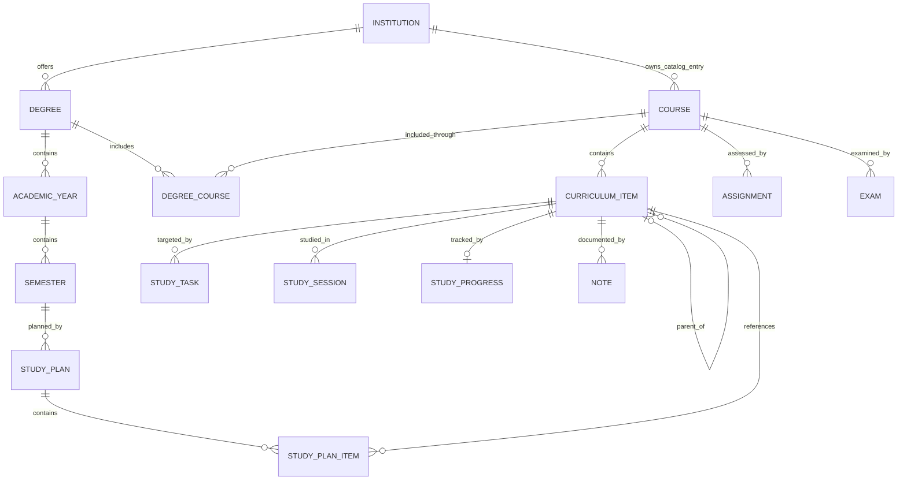

# Academic OS — Updated Domain Model

**Status:** Post-design-review domain model  
**Scope:** Domain structure only

## Entity relationship diagram

`Event` remains independent until planning-impact requirements are introduced.
Value objects are omitted from the relationship diagram because they have no
independent identity:

- `CurriculumItemType` is embedded in `CurriculumItem`.
- `StudyTaskType` is embedded in `StudyTask`.
- `StudyProgressStatus` is embedded in `StudyProgress`.

Each value object publishes canonical codes while remaining open to deliberate
institution-specific extension.

## Changes from Sprint 1

### 1. Institution became an entity

Sprint 1 stored an institution name directly on `Degree`. `Institution` now has
its own identity, and both `Degree` and catalog `Course` reference it. This
prevents duplicated institution data and establishes a stable catalog owner.

### 2. AcademicYear was added

The calendar hierarchy changed from `Degree → Semester` to
`Degree → AcademicYear → Semester`. Repeated semester names are now grouped by
an explicit historical year rather than inferred from dates or labels.

### 3. Course was separated from degree membership

`Course.degree_id` was removed. `Course` is now an institution-owned catalog
definition. `DegreeCourse` provides the explicit many-to-many association
between degrees and courses and holds degree-specific credits.

No faculty, language, or semester-type fields were added. Those belong to
organizational or course-offering concepts that are not yet in scope.

### 4. StudyPlan was separated from StudyPlanItem

Sprint 1 represented each planned curriculum item as a `StudyPlan`.
`StudyPlan` is now the semester-level aggregate, while `StudyPlanItem` associates
that plan with each `CurriculumItem`. Curriculum titles and hierarchy remain
owned exclusively by `CurriculumItem`.

### 5. StudyProgress was added

`StudyProgress` independently references `CurriculumItem` and contains a
`StudyProgressStatus`. Progress is no longer implicitly represented only by
`StudyTask.completed_at`. Its `status_updated_at` timestamp records when the
status was last set so resume behavior remains deterministic without a study
session. No completion percentage or mutable progress field was added to
immutable curriculum data.

### 6. StudyTask gained typed terminology

`StudyTask` retains its descriptive title and now also has a `StudyTaskType`
value object. This distinguishes structured categories such as reading or
practice from user-facing task descriptions without introducing a configurable
task-type entity.

### 7. CurriculumItem type became a value object

The raw `type: str` field became
`item_type: CurriculumItemType`. The renamed field is explicit, and the value
object provides a stable domain boundary without closing institution-specific
types behind an enum.

### 8. CurriculumItem gained code and pages

Sprint 2B added `code` as a stable human-readable reference while preserving
the UUID `id` as the internal identity. Optional `pages` preserves source page
ranges without treating them as numeric values.

### 9. Existing boundaries were preserved

- `CurriculumItem` still supports unlimited parent-child hierarchy.
- `StudyTask`, `StudySession`, `StudyProgress`, `Note`, and `StudyPlanItem`
  reference curriculum identifiers without copying curriculum data.
- `Assignment` and `Exam` continue to reference `Course`.
- `Event` remains independent.
- No persistence mappings, APIs, services, scheduling logic, importer
  implementation, seed data, or UI were added.

## Deliberately deferred recommendations

The review assigned these concepts to future requirement-driven sprints, so they
are not part of this model update:

- `CourseOffering`
- `StudyResource`
- event planning-impact metadata
- assessment-to-curriculum scope
- flashcards, quizzes, and learning objectives
