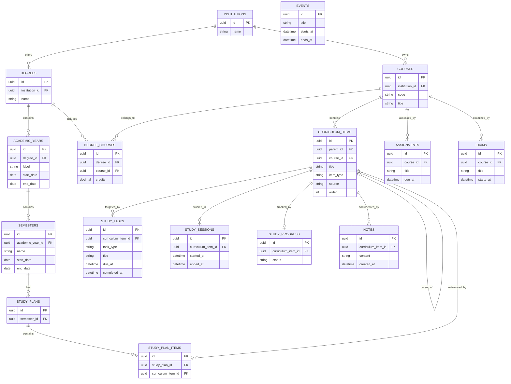

# Academic OS — Sprint 2 Persistence Foundation

## 1. Updated project structure

```text
Academic OS/
├── alembic.ini
├── migrations/
│   ├── env.py
│   ├── script.py.mako
│   └── versions/
│       └── 0001_initial_schema.py
├── src/academic_os/
│   ├── application/ports/
│   │   ├── curriculum_importer.py
│   │   ├── repositories.py
│   │   └── unit_of_work.py
│   ├── domain/
│   │   ├── entities/
│   │   └── value_objects/
│   └── infrastructure/persistence/sqlalchemy/
│       ├── database.py
│       ├── mappers.py
│       ├── models.py
│       ├── repositories.py
│       └── unit_of_work.py
└── tests/
    ├── persistence/
    │   ├── conftest.py
    │   ├── test_migrations.py
    │   └── test_persistence.py
    └── test_architecture.py
```

## 2. Database schema diagram



The schema enforces the approved one-to-one curriculum progress relationship.
No additional domain uniqueness or text-length rules were inferred at the
persistence boundary.

## 3. Repository overview

`Repository[T]` is an application-layer port with four persistence operations:

- `add(entity)`
- `get(entity_id)`
- `list_all()`
- `remove(entity_id)`

`SqlAlchemyRepository` implements this port using an injected SQLAlchemy session
and an explicit mapper. The generic implementation avoids 16 duplicated
repository classes while the Unit of Work exposes a clearly named repository
for every approved domain entity.

`UnitOfWork` is the application-layer transaction contract.
`SqlAlchemyUnitOfWork`:

- opens one session and transaction on entry;
- exposes all entity repositories;
- commits only when explicitly requested;
- supports explicit rollback;
- rolls back uncommitted work and closes the session on exit.

## 4. Alembic migration summary

Revision `0001` creates all 16 approved entity tables, their primary keys,
foreign keys, relationship indexes, and approved uniqueness constraints. It
contains no seed data or inserts.

Alembic uses the same `ACADEMIC_OS_DATABASE_URL` configuration as normal session
creation. The default is `sqlite:///academic_os.db`; another SQLAlchemy URL can
be supplied without changing mappings or migration code.

The migration was upgraded and downgraded on a new isolated database and checked
against the ORM metadata with Alembic's schema-drift check.

## 5. Testing summary

The complete suite contains 13 passing tests. Persistence coverage verifies:

- round-trip persistence for every approved domain entity;
- domain value-object conversion;
- approved ORM relationships;
- unlimited curriculum hierarchy through `parent_id`;
- repository add, get, list, and remove behavior;
- automatic transaction rollback when work is not committed;
- initial migration creation and ORM schema consistency;
- continued domain independence from SQLAlchemy, Alembic, SQLite, and
  infrastructure modules.

The Event persistence regression test covers both a nullable `ends_at` value and
a concrete end time. `Event`, `EventModel`, `EVENT_MAPPER`, and migration `0001`
all represent this field consistently. Alembic's schema-drift check protects
this model/migration parity.

Every persistence test uses a fresh SQLite database inside pytest's isolated
temporary workspace. The default application database is never created or used.

## 6. Architectural decisions

- Domain classes remain unchanged and framework-independent.
- ORM classes are separate persistence records with no business methods.
- Explicit mapper objects convert between immutable domain entities and ORM
  records.
- SQLAlchemy's portable `Uuid`, `Date`, `DateTime`, and `Numeric` types avoid
  SQLite-only schema definitions.
- Value objects are stored by their stable string codes and reconstructed at the
  mapper boundary.
- Database configuration is centralized in `database.py` and shared with
  Alembic.
- SQLite foreign-key enforcement is enabled only at the SQLite connection
  boundary; other database engines are unaffected.
- No delete cascades were introduced because deletion behavior is a domain
  decision that has not been approved.
- The existing `CurriculumImporter` interface remains untouched and has no
  implementation.
