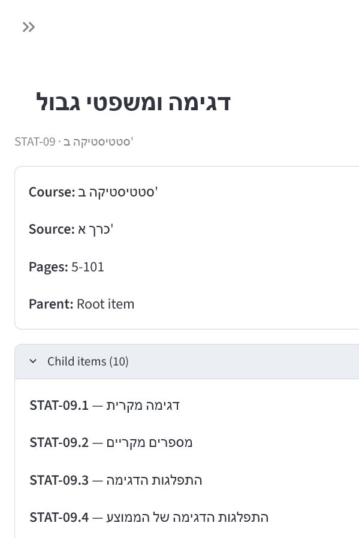
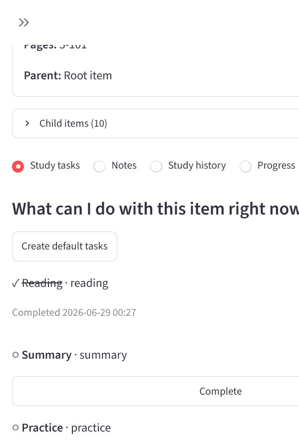

# Academic OS — Sprint 2C First Real User Experience

## Outcome

Academic OS now has a temporary single-page Streamlit workspace that exposes the
existing curriculum-item workflow without bypassing Application Services.

```text
Streamlit
  → WorkspaceService
    → Unit of Work and repositories
      → SQLAlchemy
        → SQLite
```

The interface supports:

- database initialization;
- curriculum JSON upload and import;
- course and curriculum-item selection;
- item metadata, parent, and child display;
- default task creation and task completion;
- note creation and note history;
- study-session logging and study history;
- progress display and update.

## Starting the application

```powershell
uv sync
uv run streamlit run src\academic_os\interfaces\streamlit_app.py
```

Open `http://localhost:8501`, initialize the database, and upload the curriculum
JSON from the sidebar.

## Verification

The real 63-item Hebrew curriculum was loaded into an isolated SQLite database.
The browser workflow verified:

1. course and item navigation;
2. Hebrew text, source, pages, and hierarchy;
3. default task creation;
4. reading-task completion;
5. note creation and redisplay;
6. 30-minute study-session logging and history;
7. progress update to `in_progress`.

No browser console warnings or errors were observed.

The automated suite contains 23 passing tests, including focused coverage for
database initialization through `WorkspaceService`, note/session read
projections, the duration helper, and a Streamlit startup smoke test.





## Dogfooding findings addressed

- Streamlit tabs reset after widget changes, so they were replaced with a
  persistent workspace-section selector.
- Nested columns clipped the item workspace while the setup sidebar was open,
  so selectors and item content now use a responsive vertical flow.
- Imported Hebrew content inherited left-to-right paragraph direction, so the
  temporary interface now enables automatic bidirectional text handling.

## Known limitations

- Item selection uses a dropdown without text search optimized for large
  catalogs.
- Parent and child items are displayed but are not direct navigation links.
- Notes and study sessions cannot yet be edited or deleted.
- There is no “resume last item” entry point.
- Datetimes use local process time because no timezone policy is approved.
- Streamlit is temporary and does not define the permanent frontend
  architecture.

## Recommended improvements for later approval

1. Add fast item search within a selected course.
2. Make parent and child references navigable.
3. Add a lightweight “resume last studied item” entry point.
4. Decide whether accidental notes and study sessions need correction flows.
5. Establish a timezone policy before exposing historical timestamps through a
   permanent frontend.

These recommendations were not implemented in Sprint 2C.
