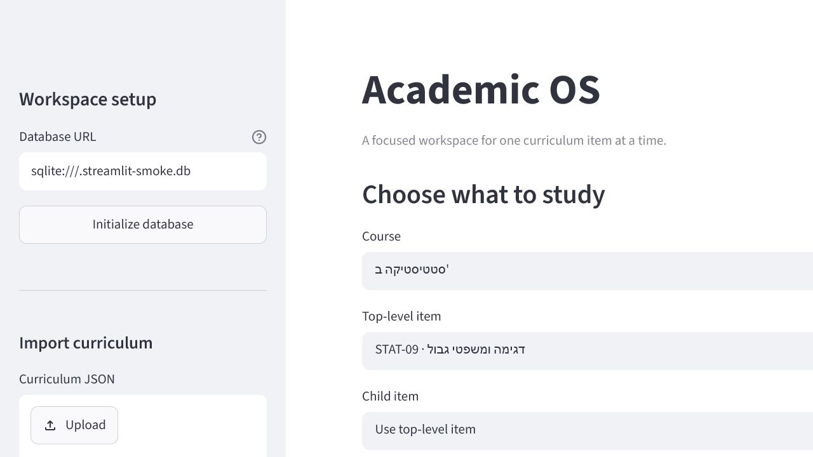
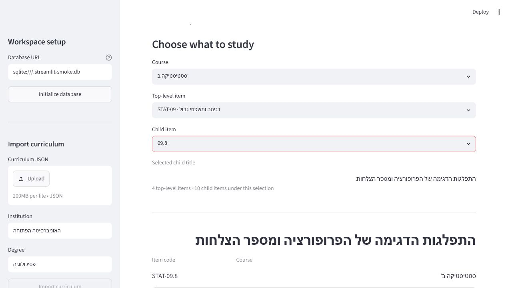

# Academic OS - Sprint 2D Hierarchical Navigation + RTL Polish

## Outcome

The temporary Streamlit workspace now supports hierarchical curriculum
navigation without changing the domain model or import pipeline.

The navigation flow is now:

```text
Course
  -> Top-level item
    -> Child item (optional)
      -> Active workspace item
```

If no child item is selected, the top-level item remains the active workspace
item. If a child item is selected, that child becomes the active workspace
item.

## What changed

- Replaced the single large curriculum-item dropdown with three selectors:
  course, top-level item, and child item.
- Limited the top-level selector to root curriculum items only.
- Limited the child selector to descendants of the selected top-level item.
- Rendered child options using local codes only, such as `09.8` instead of
  `STAT-09.8`.
- Separated code/title rendering with explicit bidirectional isolation so mixed
  Hebrew and code values do not collapse into unsafe combined strings.
- Made parent and child references in the workspace selectable so navigation can
  continue directly from the current item view.

## Verification

Automated coverage now verifies:

- top-level items are listed separately from child items;
- selecting a parent exposes only its descendants in the child selector;
- selecting a child makes the child the active workspace item;
- Hebrew titles remain intact in helper output and the Streamlit smoke flow;
- curriculum-item codes remain stable internally while child display uses the
  local suffix.

The full automated suite passes with 27 tests.

Browser verification against the real imported Hebrew catalog confirmed:

1. course -> top-level -> child navigation;
2. child selector labels use local codes only;
3. the selected child becomes the active workspace item;
4. clicking the parent reference returns the workspace to the parent item;
5. no browser console warnings or errors.

## Screenshots





## Limitations

- The temporary UI still uses selectors rather than a persistent tree view.
- Descendants are flattened into one child selector under the selected parent.
- Streamlit remains a validation surface, not the permanent frontend.
