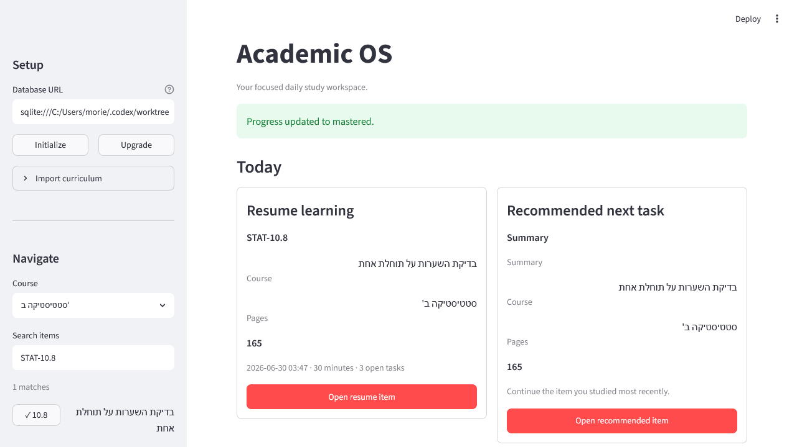
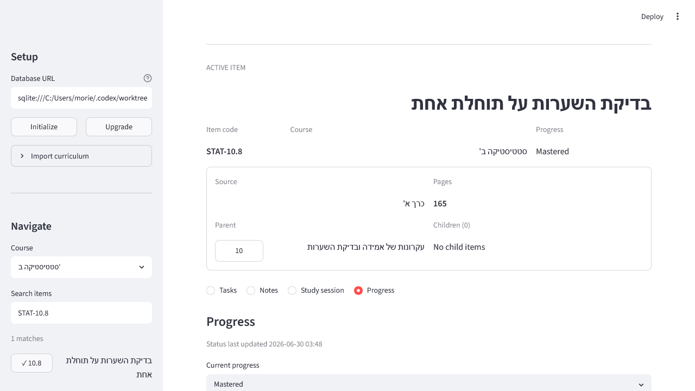

# Sprint 3.5 — Streamlit GUI Rebuild

## Why it was rebuilt

The earlier Streamlit interface validated the curriculum-item workflow but
required multiple selectors and exposed too much navigation friction. Sprint
3.5 rebuilds it as a temporary daily study workspace while preserving the
existing application-service architecture.

Streamlit continues to call only `WorkspaceService` and
`StudyWorkflowService`. It does not access repositories or persistence
directly.

## What changed

- Setup and navigation moved into one sidebar.
- Existing databases have an explicit Upgrade action.
- Navigation uses one course selector plus code/title/pages search and an
  arbitrary-depth hierarchy browser.
- Hebrew titles and LTR item codes render in separate directional fields.
- Resume and recommendation cards appear at the top of the page.
- The active item has one focused workspace with Tasks, Notes, Study session,
  and Progress sections.
- Study sessions have 15, 30, 45, and 60-minute quick actions plus custom
  minutes.
- Progress shows its current status and `status_updated_at`.
- The active item is stored in the URL query string so full browser refreshes
  restore the same item.
- Normal Streamlit reruns preserve the active item and workspace section.
- Empty states explain the next available action.

## How to use it

Apply migrations and start the interface:

```powershell
uv run academic-os init-db
uv run streamlit run src\academic_os\interfaces\streamlit_app.py
```

Then:

1. Use Initialize for a fresh database or Upgrade for an existing database.
2. Expand Import curriculum and upload the JSON catalog.
3. Choose a course.
4. Search by code, Hebrew title, or pages, or expand a hierarchy branch.
5. Open an item and use its four workspace sections.

If an old database is missing the Sprint 3 progress timestamp, the GUI shows:

> Your database schema is outdated. Use Upgrade database in the sidebar.

It never resets or deletes the database automatically.

## Screenshots





## Manual verification

Verified with an isolated SQLite database and the Hebrew curriculum catalog:

- fresh migrated database and curriculum import;
- pre-Sprint-3 database detection and sidebar upgrade;
- code search for `STAT-10.8`;
- Hebrew-title search;
- parent and child navigation;
- completing a task;
- adding a Hebrew note;
- logging a 30-minute quick session;
- changing progress to mastered;
- full browser refresh restoring `STAT-10.8`.

## Known limitations

- This remains a temporary Streamlit interface, not the permanent frontend.
- Search is scoped to the selected course.
- Search displays at most 30 matching items to keep the sidebar usable.
- The selected workspace section survives Streamlit reruns but not a full
  browser refresh; the selected item does survive through the URL.
- Course progress remains count-based and unweighted.
- There is no mobile-specific layout or permanent design system.
